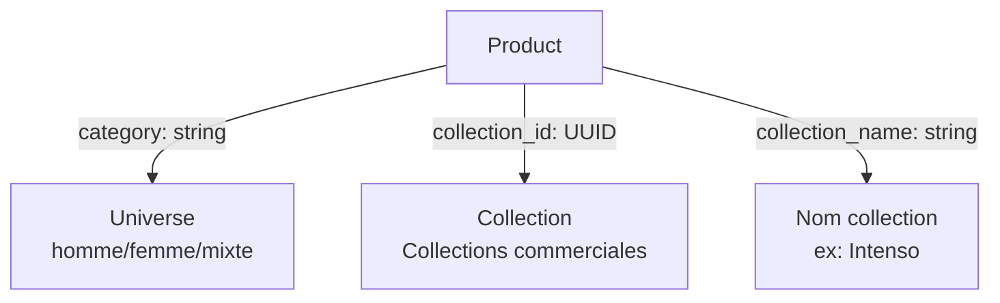

# Plan de Migration: Renommer `gender` → `category`

**Date:** 2025-01-XX  
**Auteur:** Plan généré automatiquement  
**Version:** 1.0

---

## 1. Résumé

### Contexte
Le projet VIP Parfumerie Bar utilise actuellement le champ `gender` pour classifier les produits par univers (Homme, Femme, Mixte). Parallèlement, il existe déjà des champs `categoryId` et `categoryName` qui font référence aux **collections commerciales** (ex: "Intenso", "Essentiel", "Signature").

### Problème
Le terme `gender` est trompeur car il ne désigne pas vraiment le genre du client, mais plutôt une **catégorie d'univers olfactif** ou **segment de produit**. Cette confusion crée des problèmes:
- Compréhension métier ambiguë
- Documentation floue
- Risque de collision conceptuelle avec les vraies catégories commerciales

### Objectif
Renommer **`gender`** en **`category`** partout dans le code et la base de données pour clarifier que ce champ représente la catégorie d'univers (Homme/Femme/Mixte), tout en préservant les champs existants:
- `categoryId` / `category_id` → FK vers la table `categories` (collections commerciales)
- `categoryName` → Nom de la collection commerciale (ex: "Intenso")

### Périmètre
- ✅ Renommage complet de `gender` → `category`
- ✅ Préservation de `categoryId` / `categoryName` (collections commerciales)
- ✅ Maintien des routes `/collections/homme|femme|mixte`
- ✅ Mise à jour de tous les types TypeScript
- ✅ Migration de base de données
- ✅ Tests mis à jour

---

## 2. Architecture

### 2.1 Structure Actuelle


**Fichiers clés:**
- `types/product.types.ts` — Type `Product` avec `gender`
- `types/database.types.ts` — Type `ProductGender`
- `supabase/schema.sql` — Colonne `gender` avec CHECK constraint
- `lib/product-filters.ts` — Logique de filtrage par `gender`
- `lib/supabase/products.ts` — Mapping `row.gender`
- Routes: `/collections/homme`, `/collections/femme`, `/collections/mixte`
- Composants: ProductCard, ProductDetailClient, ProduitsClient

### 2.2 Structure Cible



**Changements:**
- `gender` → `category` (univers olfactif)
- `categoryId`/`category_id` → `collectionId`/`collection_id` (collections commerciales)
- `categoryName` → `collectionName`
- Préserver la table `categories` en base (pas de renommage de table)

---

## 3. Phases d'Implémentation

### Phase 1: Préparation (≤10% context)
**Objectif:** Préparer la migration sans casser le code existant

**Tâches:**
1. ✅ Créer une branche `feat/rename-gender-to-category`
2. ✅ Documenter tous les usages de `gender` et `category*`
3. ✅ Identifier les dépendances et points de friction
4. ✅ Créer une migration SQL réversible

**Fichiers à créer:**
- `docs/plans/gender-to-category-migration.md` (ce document)
- `supabase/migrations/20250XXX_rename_gender_to_category.sql`

**Livrables:**
- [ ] Audit complet des usages
- [ ] Migration SQL testée localement
- [ ] Plan validé par l'équipe

---

### Phase 2: Migration de la Base de Données (≤15% context)
**Objectif:** Renommer la colonne `gender` en `category` en base et `category_id` en `collection_id`

**Stratégie:**
1. Approche **sans downtime** via colonne temporaire
2. Double écriture (ancien + nouveau champ)
3. Migration progressive des données
4. Validation puis suppression de l'ancien champ

**Migration SQL:**

```sql
-- Étape 1: Ajouter la nouvelle colonne `category` et `collection_id`
ALTER TABLE products 
ADD COLUMN category TEXT CHECK (category IN ('homme', 'femme', 'mixte')),
ADD COLUMN collection_id UUID REFERENCES categories(id);

-- Étape 2: Copier les données de `gender` vers `category` et `category_id` vers `collection_id`
UPDATE products SET category = gender WHERE gender IS NOT NULL;
UPDATE products SET collection_id = category_id WHERE category_id IS NOT NULL;

-- Étape 3: Créer l'index sur la nouvelle colonne
CREATE INDEX idx_products_category_new ON products(category);
CREATE INDEX idx_products_collection ON products(collection_id);

-- Étape 4: Mettre à jour les vues si nécessaire
-- (aucune vue détectée dans le projet actuellement)

-- Étape 5: Supprimer l'ancienne colonne et index (après validation)
DROP INDEX IF EXISTS idx_products_gender;
DROP INDEX IF EXISTS idx_products_category;
ALTER TABLE products DROP COLUMN gender;
ALTER TABLE products DROP COLUMN category_id;

-- Étape 6: Renommer les colonnes finales si nécessaire
-- (optionnel, selon la stratégie retenue)

COMMENT ON COLUMN products.category IS 'Univers du produit: homme, femme, mixte';
COMMENT ON COLUMN products.collection_id IS 'FK vers la table categories (collections commerciales)';
```

**Rollback:**
```sql
-- Si besoin de revenir en arrière
ALTER TABLE products ADD COLUMN gender TEXT CHECK (gender IN ('homme', 'femme', 'mixte'));
ALTER TABLE products ADD COLUMN category_id UUID REFERENCES categories(id);
UPDATE products SET gender = category WHERE category IS NOT NULL;
UPDATE products SET category_id = collection_id WHERE collection_id IS NOT NULL;
CREATE INDEX idx_products_gender ON products(gender);
CREATE INDEX idx_products_category ON products(category_id);
ALTER TABLE products DROP COLUMN category;
ALTER TABLE products DROP COLUMN collection_id;
```

**Tests de validation:**
```sql
-- Vérifier que toutes les données ont été copiées
SELECT COUNT(*) FROM products WHERE gender IS NOT NULL AND category IS NULL;
-- Résultat attendu: 0

-- Vérifier les contraintes
SELECT category, COUNT(*) FROM products GROUP BY category;
-- Résultat: seulement 'homme', 'femme', 'mixte', NULL

-- Vérifier les FK
SELECT COUNT(*) FROM products WHERE collection_id IS NOT NULL 
  AND NOT EXISTS (SELECT 1 FROM categories WHERE id = products.collection_id);
-- Résultat attendu: 0
```

**Fichiers impactés:**
- `supabase/schema.sql`
- `supabase/migrations/20240101000000_initial_schema.sql`
- `supabase/setup-all.sql`

**Livrables:**
- [ ] Migration SQL créée et testée
- [ ] Rollback plan documenté
- [ ] Tests de validation réussis

---

### Phase 3: Types TypeScript (≤20% context)
**Objectif:** Mettre à jour tous les types et interfaces TypeScript

**Fichiers à modifier:**

1. **`types/database.types.ts`**
```typescript
// AVANT
export type ProductGender = 'homme' | 'femme' | 'mixte'

// APRÈS
export type ProductCategory = 'homme' | 'femme' | 'mixte'

// Ajouter un alias temporaire pour la transition
/** @deprecated Use ProductCategory instead */
export type ProductGender = ProductCategory;
```

2. **`types/product.types.ts`**
```typescript
// AVANT
export interface Product {
  // ...
  categoryId: string | null;
  categoryName: string | null;
  gender: 'homme' | 'femme' | 'mixte' | null;
  // ...
}

// APRÈS
export interface Product {
  // ...
  collectionId: string | null;
  collectionName: string | null;
  category: 'homme' | 'femme' | 'mixte' | null;
  // ...
}

export interface ProductFilters {
  q?: string;
  category?: 'homme' | 'femme' | 'mixte';  // était gender
  collection?: string;  // était category
  // ...
}
```

**Stratégie:**
- Renommer `gender` → `category` dans `Product`
- Renommer `categoryId` → `collectionId`
- Renommer `categoryName` → `collectionName`
- Renommer le filtre `gender` → `category` dans `ProductFilters`
- Renommer le filtre `category` → `collection` dans `ProductFilters`
- Garder un alias `@deprecated` temporaire pour faciliter la transition

**Livrables:**
- [ ] Types mis à jour
- [ ] Alias de transition créés
- [ ] Documentation des types mise à jour

---

### Phase 4: Mapping et Logique Métier (≤30% context)
**Objectif:** Mettre à jour toute la couche de mapping et la logique de filtrage

**Fichiers à modifier:**

1. **`lib/supabase/products.ts`**
```typescript
// AVANT
function mapRow(row: Record<string, unknown>): Product {
  return {
    // ...
    categoryId: (row.category_id as string) ?? null,
    categoryName: (row.categories as { name: string } | null)?.name ?? null,
    gender: (row.gender as Product['gender']) ?? null,
    // ...
  };
}

// APRÈS
function mapRow(row: Record<string, unknown>): Product {
  return {
    // ...
    collectionId: (row.collection_id as string) ?? null,
    collectionName: (row.categories as { name: string } | null)?.name ?? null,
    category: (row.category as Product['category']) ?? null,
    // ...
  };
}

// Mettre à jour les filtres
function applyProductFilters(query: any, filters: ProductFilters) {
  // AVANT: if (filters.gender)
  if (filters.category) {
    query = query.eq('category', filters.category);
  }

  // AVANT: if (filters.category && ['homme', 'femme', 'mixte'].includes(filters.category))
  if (filters.collection && ['homme', 'femme', 'mixte'].includes(filters.collection)) {
    query = query.eq('category', filters.collection);
  }
  // ...
}
```

2. **`lib/supabase/admin-products.ts`**
```typescript
// Mettre à jour tous les mappings similaires
// Renommer gender → category
// Renommer category_id → collection_id
```

3. **`lib/product-filters.ts`**
```typescript
// Mettre à jour les données mockées
export const MOCK_PRODUCTS: Product[] = [
  {
    // ...
    collectionId: 'cat-homme',
    collectionName: 'Parfums Homme',
    category: 'homme',
    // ...
  },
  // ...
];

// Mettre à jour la logique de filtrage
export function filterProducts(source: Product[], filters: ProductFilters) {
  // ...
  if (filters.category) {
    products = products.filter((p) => p.category === filters.category);
  }
  
  if (filters.collection) {
    const slug = filters.collection;
    if (['homme', 'femme', 'mixte'].includes(slug)) {
      products = products.filter((p) => p.category === slug);
    }
  }
  // ...
}
```

**Livrables:**
- [ ] Mapping mis à jour
- [ ] Logique de filtrage corrigée
- [ ] Données mockées mises à jour

---

### Phase 5: API Routes (≤20% context)
**Objectif:** Mettre à jour toutes les routes API

**Fichiers à modifier:**

1. **`app/api/products/route.ts`**
```typescript
// Vérifier les paramètres de requête
// AVANT: const gender = searchParams.get('gender')
const category = searchParams.get('category')
const collection = searchParams.get('collection')

// Mettre à jour les appels à getProducts()
const { products, total, totalPages } = await getProducts({
  q,
  category,  // était gender
  collection,  // était category
  // ...
});
```

2. **`app/api/admin/products/route.ts`**
```typescript
// Mettre à jour les mutations (POST/PUT)
// Renommer les champs lors de l'insertion/mise à jour
```

**Livrables:**
- [ ] Routes API mises à jour
- [ ] Validation des paramètres adaptée
- [ ] Tests d'API ajustés

---

### Phase 6: Composants Frontend (≤40% context)
**Objectif:** Mettre à jour tous les composants React utilisant `gender`

**Fichiers à modifier (liste non exhaustive):**

1. **Pages de collection statiques:**
   - `app/(shop)/collections/homme/page.tsx`
   - `app/(shop)/collections/femme/page.tsx`
   - `app/(shop)/collections/mixte/page.tsx`
   - `app/(shop)/collections/[category]/page.tsx` (renommer le segment dynamique si nécessaire)

2. **Composants produits:**
   - `app/(shop)/produits/ProduitsClient.tsx`
   - `app/(shop)/produits/[slug]/ProductDetailClient.tsx`
   - `app/(shop)/page.tsx` (homepage)
   - `components/ProductCard.tsx`
   - `components/ProductGallery.tsx`

3. **Admin:**
   - `app/admin/produits/page.tsx`

**Exemple de modification:**
```tsx
// AVANT
<ProductCard
  product={p}
  category={p.gender ?? 'mixte'}
/>

// APRÈS
<ProductCard
  product={p}
  category={p.category ?? 'mixte'}
/>
```

**Stratégie:**
- Remplacer tous les `product.gender` par `product.category`
- Remplacer tous les `product.categoryId` par `product.collectionId`
- Remplacer tous les `product.categoryName` par `product.collectionName`
- Mettre à jour les props des composants
- Conserver les routes `/collections/homme|femme|mixte` (pas de changement)

**Livrables:**
- [ ] Tous les composants mis à jour
- [ ] Props adaptées
- [ ] Routes statiques maintenues

---

### Phase 7: Utilitaires et Helpers (≤15% context)
**Objectif:** Mettre à jour les fonctions helper et utilitaires

**Fichiers à modifier:**

1. **`app/(shop)/produits/[slug]/ProductDetailClient.tsx`**
```typescript
// Fonction helper existante
function getGenderLabel(g: string | null): string {
  if (!g) return '—';
  return g.charAt(0).toUpperCase() + g.slice(1);
}

// Renommer en getCategoryLabel
function getCategoryLabel(c: string | null): string {
  if (!c) return '—';
  return c.charAt(0).toUpperCase() + c.slice(1);
}
```

2. **Scripts de setup:**
   - `scripts/setup-database.ts`
   - Mettre à jour la logique de mapping lors de la création de produits

**Livrables:**
- [ ] Fonctions helper renommées
- [ ] Scripts de setup mis à jour
- [ ] Aucune référence à `gender` restante

---

### Phase 8: Tests (≤30% context)
**Objectif:** Créer et mettre à jour tous les tests

**Tests à créer/modifier:**

1. **Tests unitaires:**
   - `lib/product-filters.test.ts` — Tests de la logique de filtrage
   - `lib/supabase/products.test.ts` — Tests du mapping

2. **Tests d'intégration:**
   - `app/api/products/route.test.ts` — Tests des API
   - Tests des pages de collection

3. **Tests E2E:**
   - `e2e/collections.spec.ts` — Parcours utilisateur sur les pages de collection
   - `e2e/product-details.spec.ts` — Détails produit

**Exemple de test:**
```typescript
// product-filters.test.ts
describe('filterProducts', () => {
  it('filters by category', () => {
    const products = [
      { id: '1', category: 'homme', /* ... */ },
      { id: '2', category: 'femme', /* ... */ },
    ];
    
    const result = filterProducts(products, { category: 'homme' });
    expect(result.products).toHaveLength(1);
    expect(result.products[0].category).toBe('homme');
  });

  it('filters by collection slug', () => {
    const products = [
      { id: '1', category: 'homme', /* ... */ },
      { id: '2', category: 'femme', /* ... */ },
    ];
    
    const result = filterProducts(products, { collection: 'homme' });
    expect(result.products).toHaveLength(1);
    expect(result.products[0].category).toBe('homme');
  });
});
```

**Livrables:**
- [ ] Tests unitaires créés
- [ ] Tests d'intégration mis à jour
- [ ] Tests E2E validés
- [ ] Couverture ≥ 80%

---

### Phase 9: Documentation (≤10% context)
**Objectif:** Mettre à jour toute la documentation

**Fichiers à modifier:**

1. **README.md**
   - Mettre à jour les exemples de structure de données

2. **Commentaires dans le code**
   - Vérifier les commentaires mentionnant `gender`

3. **Types et schemas**
   - Ajouter des commentaires JSDoc clairs

**Exemple:**
```typescript
export interface Product {
  /**
   * Catégorie d'univers du produit (segmentation par cible)
   * @example 'homme' | 'femme' | 'mixte'
   */
  category: 'homme' | 'femme' | 'mixte' | null;
  
  /**
   * ID de la collection commerciale (ex: "Intenso", "Essentiel")
   * Référence vers la table `categories`
   */
  collectionId: string | null;
  
  /**
   * Nom de la collection commerciale
   */
  collectionName: string | null;
}
```

**Livrables:**
- [ ] README mis à jour
- [ ] Commentaires JSDoc ajoutés
- [ ] Documentation technique complète

---

### Phase 10: Déploiement et Validation (≤15% context)
**Objectif:** Déployer en production et valider la migration

**Checklist de déploiement:**

1. **Pré-déploiement:**
   - [ ] Tests locaux passent (unit + integration + E2E)
   - [ ] Couverture de code ≥ 80%
   - [ ] Review de code approuvée
   - [ ] Migration SQL testée sur un dump de production
   - [ ] Plan de rollback documenté

2. **Déploiement:**
   - [ ] Backup de la base de données
   - [ ] Exécution de la migration SQL
   - [ ] Déploiement du nouveau code
   - [ ] Vérification des logs (erreurs 500, 404)

3. **Post-déploiement:**
   - [ ] Tests de fumée (smoke tests)
   - [ ] Vérification des routes `/collections/homme|femme|mixte`
   - [ ] Vérification de l'admin produits
   - [ ] Monitoring des erreurs (Sentry, logs)

4. **Validation métier:**
   - [ ] Filtres fonctionnent correctement
   - [ ] Les collections commerciales s'affichent
   - [ ] Aucune régression visuelle
   - [ ] Performance stable

**Rollback plan:**
- Si problème critique détecté dans les 24h:
  1. Rollback du code vers l'ancienne version
  2. Exécution du script SQL de rollback
  3. Vérification que l'ancien système fonctionne
  4. Post-mortem et analyse de la cause

**Livrables:**
- [ ] Déploiement réussi
- [ ] Validation métier complète
- [ ] Monitoring en place
- [ ] Documentation de rollback

---

## 4. Dépendances et Risques

### Dépendances

| Composant | Dépendance | Impact |
|-----------|------------|--------|
| Types TypeScript | Migration BDD | ⚠️ HAUTE - Les types doivent matcher la BDD |
| API Routes | Types TypeScript | 🔶 MOYENNE - Risque de breaking changes |
| Composants Frontend | API Routes | 🔶 MOYENNE - Affichage des données |
| Tests | Tous les composants | ⚠️ HAUTE - Tests doivent couvrir tous les changements |

### Risques

| Risque | Probabilité | Impact | Mitigation |
|--------|-------------|--------|------------|
| **Breaking changes en production** | 🔶 Moyenne | ⚠️ CRITIQUE | Migration avec double écriture, tests exhaustifs |
| **Perte de données lors de la migration** | 🟢 Faible | ⚠️ CRITIQUE | Backup avant migration, validation post-migration |
| **Régression des filtres** | 🔶 Moyenne | 🔶 HAUTE | Tests unitaires et E2E complets |
| **Routes cassées** | 🟢 Faible | 🔶 HAUTE | Tests E2E sur toutes les routes |
| **Confusion entre `category` et `collection`** | 🔶 Moyenne | 🔶 MOYENNE | Documentation claire, nommage explicite |

### Signaux d'alerte

Arrêter la migration si:
- ❌ Les tests de migration SQL échouent
- ❌ Perte de données détectée pendant la validation
- ❌ Plus de 5% de requêtes API échouent après déploiement
- ❌ Régression des performances > 20%

---

## 5. Tests et Validation

### Tests Unitaires

| Module | Fichier de test | Couverture cible |
|--------|-----------------|------------------|
| Filtres produits | `lib/product-filters.test.ts` | 95% |
| Mapping Supabase | `lib/supabase/products.test.ts` | 90% |
| Admin produits | `lib/supabase/admin-products.test.ts` | 85% |

### Tests d'Intégration

| API Route | Cas de test | Statut |
|-----------|-------------|--------|
| `GET /api/products` | Filtrage par `category` | ⏳ |
| `GET /api/products` | Filtrage par `collection` | ⏳ |
| `GET /api/products?category=homme` | Retourne produits homme | ⏳ |
| `POST /api/admin/products` | Création avec `category` | ⏳ |
| `PUT /api/admin/products/:id` | Mise à jour `category` | ⏳ |

### Tests E2E (Playwright)

| Parcours | Description | Statut |
|----------|-------------|--------|
| Collection Homme | Navigation `/collections/homme` → affichage produits homme | ⏳ |
| Collection Femme | Navigation `/collections/femme` → affichage produits femme | ⏳ |
| Collection Mixte | Navigation `/collections/mixte` → affichage produits mixtes | ⏳ |
| Filtres produits | Page `/produits` → filtre par `category` fonctionne | ⏳ |
| Détails produit | Page produit → champ "Univers" affiche la bonne catégorie | ⏳ |
| Admin produits | CRUD produit → `category` et `collectionId` fonctionnent | ⏳ |

### Critères de succès

✅ Migration réussie si:
- Tous les tests passent (unit + integration + E2E)
- Couverture de code ≥ 80%
- Aucune régression de performance (< 5%)
- Aucune perte de données
- Les routes `/collections/homme|femme|mixte` fonctionnent
- L'admin produits fonctionne sans erreur
- Aucune erreur 500 en production pendant 48h

---

## 6. Checklist de Validation

### Avant le merge

- [ ] Toutes les phases 1-9 sont terminées
- [ ] Tests unitaires passent (≥ 80% couverture)
- [ ] Tests d'intégration passent
- [ ] Tests E2E passent
- [ ] Code review approuvée par 2 personnes
- [ ] Migration SQL testée sur dump de production
- [ ] Documentation mise à jour
- [ ] Plan de rollback documenté

### Après le merge

- [ ] Migration SQL exécutée avec succès
- [ ] Déploiement en production réussi
- [ ] Smoke tests passent
- [ ] Routes `/collections/*` fonctionnent
- [ ] Admin produits fonctionne
- [ ] Monitoring actif (logs, Sentry)
- [ ] Validation métier complète

### 48h après déploiement

- [ ] Aucune erreur 500 détectée
- [ ] Performance stable (< 5% dégradation)
- [ ] Aucun feedback négatif des utilisateurs
- [ ] Métriques métier stables
- [ ] Supprimer les colonnes `gender` et `category_id` de la BDD
- [ ] Supprimer les alias `@deprecated` du code

---

## 7. Timeline Estimée

| Phase | Durée estimée | Dépendances |
|-------|---------------|-------------|
| 1. Préparation | 2h | — |
| 2. Migration BDD | 3h | Phase 1 |
| 3. Types TypeScript | 2h | Phase 2 |
| 4. Mapping & Logique | 4h | Phase 3 |
| 5. API Routes | 2h | Phase 4 |
| 6. Composants Frontend | 6h | Phase 5 |
| 7. Utilitaires | 2h | Phase 6 |
| 8. Tests | 8h | Phases 2-7 |
| 9. Documentation | 2h | Phase 8 |
| 10. Déploiement | 3h | Phase 9 |

**Durée totale estimée:** 34 heures (~4-5 jours de travail)

---

## 8. Notes et Décisions

### Décision 1: Renommage de `categoryId` → `collectionId`

**Contexte:**  
Actuellement, `categoryId` fait référence à la table `categories` qui contient les collections commerciales (ex: "Intenso", "Essentiel"). Avec le renommage de `gender` → `category`, il y a un risque de confusion.

**Décision:**  
Renommer `categoryId` → `collectionId` et `categoryName` → `collectionName` pour éviter toute ambiguïté.

**Alternatives considérées:**
1. ❌ Garder `categoryId` → Risque de confusion avec le nouveau champ `category`
2. ❌ Renommer la table `categories` → Trop impactant (migrations existantes, références FK)
3. ✅ Renommer `categoryId` → `collectionId` → Solution la plus claire

---

### Décision 2: Conserver les routes `/collections/homme|femme|mixte`

**Contexte:**  
Les routes actuelles utilisent des segments statiques basés sur les valeurs de `gender` (homme/femme/mixte).

**Décision:**  
Conserver ces routes sans changement pour éviter les broken links et maintenir le SEO.

**Impact:**
- Aucun changement dans `app/(shop)/collections/homme/page.tsx`
- Aucun changement dans le sitemap
- Aucun changement dans les liens du Header/Footer

---

### Décision 3: Migration SQL avec double écriture

**Contexte:**  
La migration sans downtime nécessite une stratégie robuste.

**Décision:**  
Utiliser une approche de **double écriture**:
1. Ajouter les nouvelles colonnes `category` et `collection_id`
2. Copier les données de `gender` → `category` et `category_id` → `collection_id`
3. Valider que toutes les données sont correctes
4. Déployer le nouveau code (qui utilise les nouvelles colonnes)
5. Après 48h de validation, supprimer les anciennes colonnes

**Avantages:**
- ✅ Pas de downtime
- ✅ Rollback possible facilement
- ✅ Validation progressive

---

## 9. Ressources et Références

### Documentation technique
- [Supabase Migrations](https://supabase.com/docs/guides/database/migrations)
- [TypeScript 5.x Handbook](https://www.typescriptlang.org/docs/)
- [Next.js 16 App Router](https://nextjs.org/docs/app)
- [Playwright Testing](https://playwright.dev/docs/intro)

### Fichiers clés du projet
- `types/product.types.ts` — Types produit
- `lib/supabase/products.ts` — Logique Supabase
- `supabase/schema.sql` — Schéma de base de données
- `app/(shop)/collections/[category]/page.tsx` — Page de collection dynamique

### Contacts
- **Responsable produit:** [À compléter]
- **Lead technique:** [À compléter]
- **DevOps:** [À compléter]

---

## 10. Changelog

| Version | Date | Auteur | Changements |
|---------|------|--------|-------------|
| 1.0 | 2025-01-XX | AI Agent | Création initiale du plan |

---

**Statut du plan:** ✅ Prêt pour review  
**Prochaines étapes:** Review par l'équipe → Validation → Exécution Phase 1
